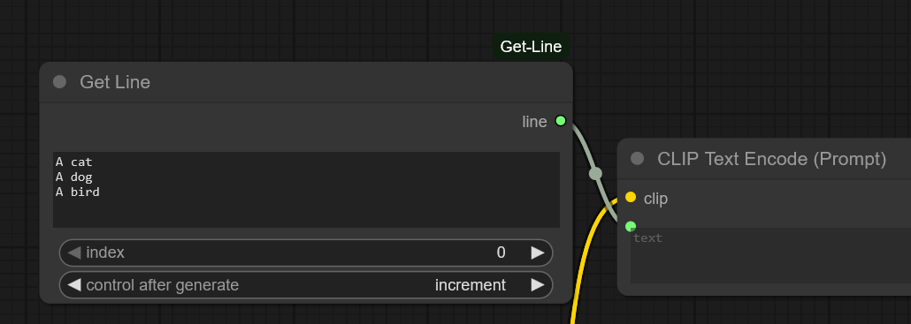
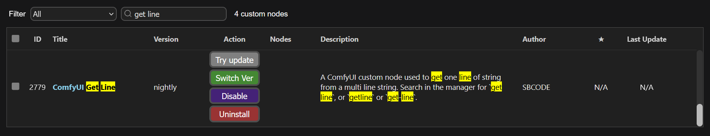
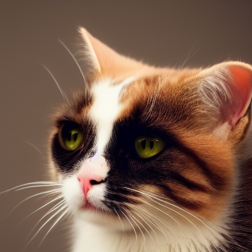
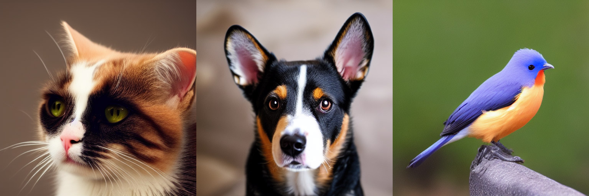
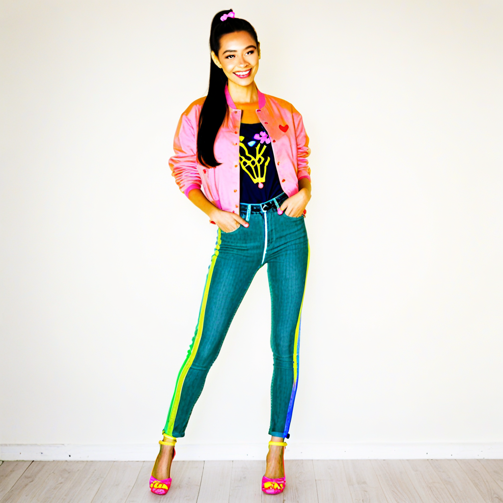
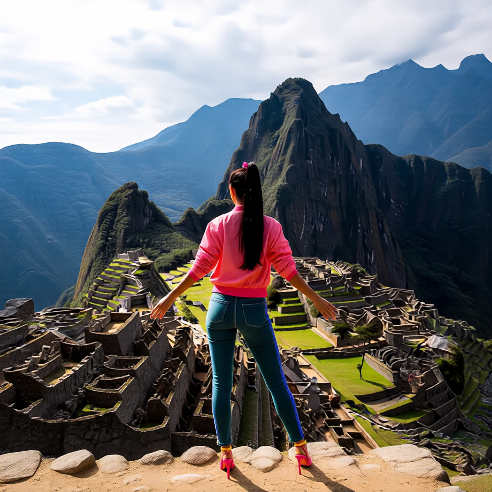
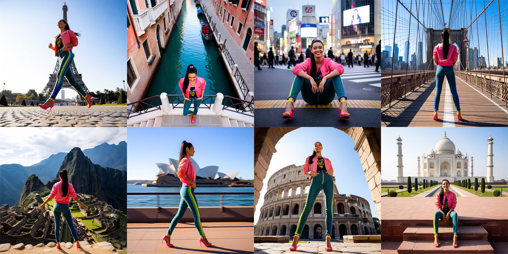

# ComfyUI Get Line

A ComfyUI custom node used to get one line of string from a multiline string.



## Install

You will find it in the manager.

Search for `get line`, `get-line` or `getline`



## Sample Workflows

Drag example workflows into ComfyUI.

_Note that you usually can't drag from GitHub, so drag or download to your desktop/pc first, and then drag into ComfyUI from there._

### SD1.5 Example

#### Worflow



#### Multiline Prompt

```text
A cat
A dog
A bird
```

#### Output (_concatenated_)



### Qwen Edit 2509 Example

| Intitial Image                                                    | Workflow                                                      |
| ----------------------------------------------------------------- | ------------------------------------------------------------- |
|  |  |

#### Multiline Prompt

```text
Low-angle three-quarter view, full-body pose mid-stride, camera slightly tilted upward, wide lens capturing dynamic motion, foreground-to-background depth, set in front of the Eiffel Tower in Paris.
High-angle top-down view, relaxed standing pose with weight on one leg, camera looking downward, centered composition, symmetrical framing, overlooking the canals of Venice.
Eye-level medium shot, seated pose with elbows resting on knees, camera square to subject, shallow depth of field, bustling street scene at Shibuya Crossing in Tokyo.
Over-the-shoulder view from behind, upright pose facing outward, camera positioned slightly above shoulder height, strong leading lines, city skyline of New York from Brooklyn Bridge.
Wide establishing shot, full-body pose with arms slightly extended, camera pulled back at eye level, expansive framing, dramatic landscape perspective at Machu Picchu.
Side-profile shot, walking pose captured mid-step, camera parallel to subject, motion blur in background, harbor setting at the Sydney Opera House.
Low-angle close-to-medium shot, confident standing pose, camera angled upward from waist height, monumental framing, ancient stone backdrop at the Colosseum in Rome.
High-angle wide shot, seated pose on steps, camera looking down diagonally, balanced composition, iconic landmark setting at the Taj Mahal in Agra.
```

#### Output (_concatenated_)


